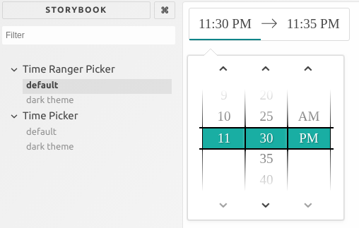

# (awesome) React Times Picker

An awesome time picker for React!

  * TimePicker - pick a minute of day
  * TimeRangePicker - pick a time range in a day
  
  
  
## Testing it out

```
$ git clone https://github.com/mdiponio/react-times.git

$ npm install

$ npm run storybook
```

## Using it
 
Using DateTimePicker

```jsx harmony
import React from "react";

import { TimePicker } from "@euvs/time_picker";

// Import CSS
import "@euvs/time_picker/dist/style.css";

class Example extends React.Component {
    constructor(props) {
        super(props);
        
        this.state = {
            time: 0,  // Minute of day from 0 to 24 * 60
        }        
    }
        
    render() {
        return (
            <TimePicker time={this.state.time} onSelect={(time) => this.setState({ time })} />
        );
    }
}
```
  
Using TimeRangePicker 
```jsx harmony
import React from "react";

import { TimeRangePicker } from "@euvs/time_picker";

// Import CSS
import "@euvs/time_picker/dist/style.css";

class ExampleRange extends React.Component {
    constructor(props) {
        super(props);
        
        this.state = {
            from: 0,  // Beginning time, minute of day from 0 to 24 * 60
            to: 0,    // End time
        }        
    }
        
    render() {
        return (
            <TimeRangePicker to={this.state.from} from={this.state.to} onSelect={(from, to) => this.setState({ from, to })} />
        );
    }
}
```

## Component props

### `<TimePicker />`

| Prop        | Description | Type | Mandatory | Default |
| ----------- | ----------- | ---- | ----------| ------- |
| `min`       | Time of day in minutes (e.g. 5:30 PM is 1050). | number | y | |
| `onSelect`  | Event triggered when time picked. When function is called, it is passed a new time value. <br>**Must to set to update `min` prop value!!!** | function | y ||
| `step`      | Increment between minutes. | number | n | 5 | 
| `amPm`      | Whether to display time in AM PM format or 24hr format. | boolean | n | true |
| `dark`      | Whether to use dark theme. | boolean | n | false|
| `className` | Class selector to add to component | string | n | |

### `<TimeRangePicker />`

| Prop        | Description | Type | Mandatory | Default |
| ----------- | ----------- | ---- | ----------| ------- |
| `from`       | Range start time of day in minutes. | number | y | |
| `to`       | Range end time of day in minutes. This is at minimum `step` minutes after `from`. | number | y | |
| `onSelect`  | Event triggered when time picked. When function is called, it is passed a new `from` and `to` values. . <br>**Must to set to update both `from` and `to` prop values!!!** | function | y ||
| `step`      | Increment between minutes. | number | n | 15 | 
| `amPm`      | Whether to display time in AM PM format or 24hr format. | boolean | n | true |
| `dark`      | Whether to use dark theme. | boolean | n | false|
| `className` | Class selector to add to component | string | n | |
